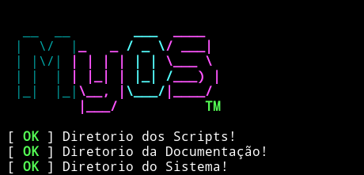

# Projeto MyOS

	
  Worspace para criar um Sistema Operacional.

## Bibliotecas e Dependencias

* [crosstool-ng](https://github.com/crosstool-ng/crosstool-ng) - Compilador
* [Bash](https://www.gnu.org/software/bash/) - Shell para usar os scripts e para implantar no sistema
* [C/C++](http://www.cplusplus.com) - Linguagem base 
* [libc](https://www.gnu.org/software/libc/) - Biblioteca C Padrão, provavelemnte seŕá a glibc da gnu
* [Openbsd Build From Source](https://www.openbsd.org/faq/faq5.html) - Guia para buildar o openbsd atraves dos files

<!--
" Todos temos um talento especial, e quando você descobrir o seu. Espero que seja controlavel e não que controle você." Um Anonimo
" Pelo jeito o meu talento e criar repositorios no GitHub! Kkkk."   Gil
-->
